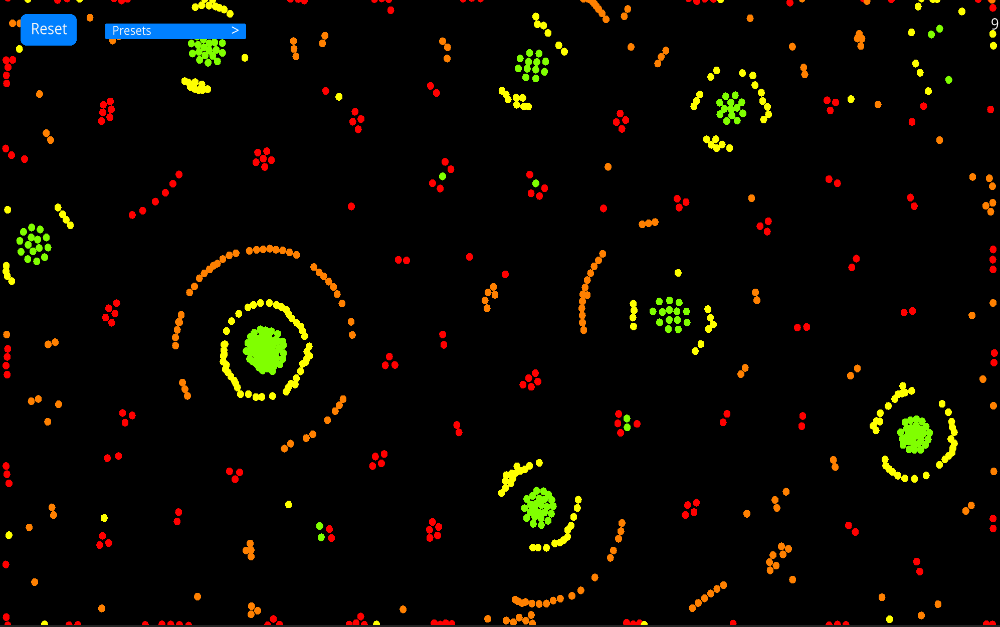

# Life-101

The *Life-101* repository is dedicated to a few example projects showcasing **emergence**, 
**cellular automatons**, and just general simulations of apparent **life-like behaviour**.

## The Property of Emergence
|  |
|:-:|
| [Image](https://www.researchgate.net/figure/Unexpected-emergent-behaviour-of-the-mass-on-the-example-of-a-bird-flock-Simple_fig8_278009687) |

[*Emergence*](https://necsi.edu/emergence#:~:text=In%20describing%20collective%20behaviors%2C%20emergence,relationships%20at%20a%20finer%20scale.) 
or an emerging property is a property that a system
or individual has, that the components of said individual or system do not posses. It is the rise of complicated and different behaviour, from a collection of much simpler elements.

Essentially, the combination of small parts with simple rules that when working together yield morse 
sophisticated functions. Any complex life form is a primary example of emergence/emergent properties:
wherein a collection of cells (which they themselves are just proteins and organelles) can develop 
a complex creature (such as a human) with even more complex behaviours, such as emotion, collaboration
and even sentience. The cells and proteins of course posses no such characteristics, yet the simple behaviours and rules of 
these small components bring together the capability of something much more complex and intelligent.

## Particle Life

Particle life is a Python port (and personal implementation) of [this video](https://www.youtube.com/watch?v=Z_zmZ23grXE&t=15s)
from [*CodeParade*](https://www.youtube.com/channel/UCrv269YwJzuZL3dH5PCgxUw). The code uses the [*Ursina*](https://www.ursinaengine.org/) graphics engine
for all rendering and graphics. The code was further optimized with the *jit compiler* from [*Numba*](http://numba.pydata.org/)
to allow for smooth performance especially with many particles.

|  |  |
|:-:| :-: |
| |  |

#### Explanation

The principles of Particle Life were originally inspired by Jeffrey Ventrella's [*Clusters*](http://www.ventrella.com/Clusters/). Essentially, different classes of particles (represented by the colour of the particle) are randomly initialized with different attraction and repulsion forces between themselves, along with a few other parameters influencing those forces. Jeffrey Ventrella explains the concept from [http://ventrella.com/Clusters/](http://ventrella.com/Clusters/) as:

*"All organisms naturally gravitate to other kinds of organisms, and likewise are repelled by different organisms. These particles experience attractions and repulsions with other particles of different colors. They cluster into social pods, or scatter and flee, often mimicking biological behaviors."*
