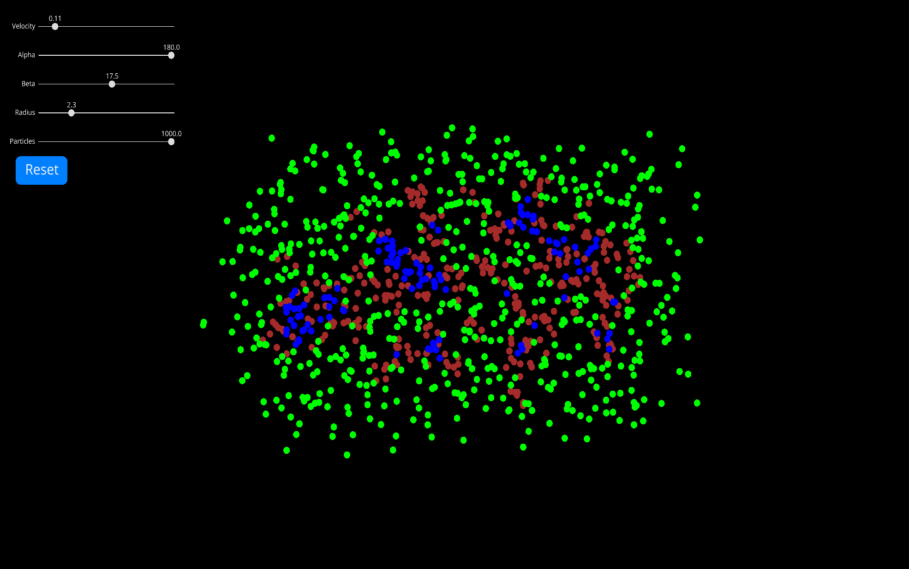

# Life-101

The *Life-101* repository is dedicated to a few example projects showcasing **emergence**, 
**cellular automatons**, and just general simulations of apparent **life-like behaviour**.

## Contents

- [The Property of Emergence](#The-Property-of-Emergence)
- [Particle Life](#Particle-Life)
	- [Explanation](#Explanation)
	- Found [here](./plife)
- [Primordial Particle System](Primordial-Particle-System)
	- [Explanation](#Explanation)
	- Found [here](./pps)

##### Note: At this time, not all simulations are perfectly responsive to all screens

## The Property of Emergence
|  |
|:-:|
| [Image](https://www.researchgate.net/figure/Unexpected-emergent-behaviour-of-the-mass-on-the-example-of-a-bird-flock-Simple_fig8_278009687) |

[*Emergence*](https://necsi.edu/emergence#:~:text=In%20describing%20collective%20behaviors%2C%20emergence,relationships%20at%20a%20finer%20scale.) 
or an emerging property is a property that a system
or individual has, that the components of said individual or system do not posses. It is the rise of complicated and different behaviour, from a collection of much simpler elements.

Essentially, the combination of small parts with simple rules that when working together yield morse 
sophisticated functions. Any complex life form is a primary example of emergence/emergent properties:
wherein a collection of cells (which they themselves are just proteins and organelles) can develop 
a complex creature (such as a human) with even more complex behaviours, such as emotion, collaboration
and even sentience. The cells and proteins of course posses no such characteristics, yet the simple behaviours and rules of 
these small components bring together the capability of something much more complex and intelligent.

## Particle Life

Particle life is a Python port (and personal implementation) of [this video](https://www.youtube.com/watch?v=Z_zmZ23grXE&t=15s)
from [*CodeParade*](https://www.youtube.com/channel/UCrv269YwJzuZL3dH5PCgxUw). The code uses the [*Ursina*](https://www.ursinaengine.org/) graphics engine
for all rendering and graphics. The code was further optimized with the *jit compiler* from [*Numba*](http://numba.pydata.org/)
to allow for smooth performance especially with many particles.

|  |  |
|:-:| :-: |
| |  |

### Explanation

The principles of Particle Life were originally inspired by Jeffrey Ventrella's [*Clusters*](http://www.ventrella.com/Clusters/). Essentially, different classes of particles (represented by the colour of the particle) are randomly initialized with different attraction and repulsion forces between themselves, along with a few other parameters influencing those forces. Jeffrey Ventrella explains the concept from [http://ventrella.com/Clusters/](http://ventrella.com/Clusters/) as:

*"All organisms naturally gravitate to other kinds of organisms, and likewise are repelled by different organisms. These particles experience attractions and repulsions with other particles of different colors. They cluster into social pods, or scatter and flee, often mimicking biological behaviors."*

## Primordial Particle System

A *primordial particle system* is an environment of particles that move and act based on a single equation. Life-like behaviours and properties can be observed, such as the creation of somewhat functioning "cells". The parameters of the motion equation of the particles can be tweaked, which allows for the experimentation and observation of what kind of results and interesting behaviours different settings might achieve.

|  |  |
|:-:| :-: |
| |  |

### Explanation

The idea and implementation of this primordial particle system is from [this video](https://www.youtube.com/watch?v=makaJpLvbow) from *[IZGartlife](https://www.youtube.com/channel/UCBoryeFK_61rcKu8GNv6hLw)*. There also exists a research paper on the topic and implementation available [here](https://www.nature.com/articles/srep37969). he code uses the [*Ursina*](https://www.ursinaengine.org/) graphics engine
for all rendering and graphics. The code was further optimized with the *jit compiler* from [*Numba*](http://numba.pydata.org/)
to allow for smooth performance especially with many particles. 

The simulation starts with a given number of particles initialized at random coordinates in the environment. Every particle has:

- A position *(x, y)*
- An orientation &Phi;
- A constant velocity *v*

The constant **velocity** is the same amongst all particles in the system for a given environment.

Every timestep, each particle will rotate by a fixed angle &alpha;

The property that yields such interesting behaviour is that particles are influenced by their neighbours. Every particle has a sensing circle with given radius *r*, that within that radius will count the number of other particles in both the *Left* (Top) hemisphere and *Right* (Bottom) hemisphere. The particle will then turn towards the hemisphere with more particles, expressed by: 

sign(Rt-Lt) * &beta; * Nt

Where Rt is the number of particles in the *Right* hemisphere at a given timestep, Lt is the number of particles in the *Left* hemisphere at a given timestep, &beta; is a settable angle parameter and Nt is the sum of particles in both *Right* and *Left* hemispheres.

The **radius** of which a particle can sense it's surrounding neighbours is a settable parameter and constant amongst all in the system of a given environment.s

The final motion equation of the particles is thus:

&Delta;&Phi;/&Delta;t = &alpha; + sign(Rt-Lt) * &beta; * Nt

The position of the particle *p* in the consecutive timestep *pt+1* is then updated by:

pt+1 = pt + ((cos &Phi;t), (sin &Phi;t)) * v

The implementation is slightly different however, as the parameters act within *Ursina* slightly differently than in the research paper. This is not really an issue, as it just affects the scale of the numbers required to achieve the same behaviour (the parameters such as **radius** and **velocity** just needed to be increased by a factor of **10** to act the same). **The equation is exactly the same**. The particles will also generate with random coordinates only in a set boundary box (they can however be free to move past it).

## TODO:

- Must update READMEs for all different simulations

### Conway's Game of Life

- Must add the final simulation: **Conway's Game of Life**
	- Must add respective documentation
	- Take images

### Responsiveness

- Must make PPS responsive
- Improve crude responsiveness for PLIFE
- Make Conway's GOF responsive